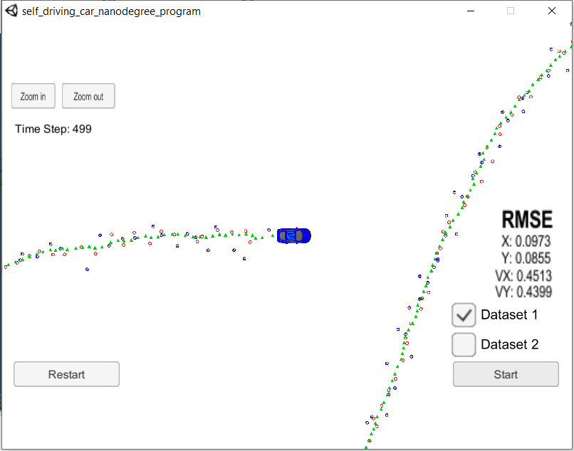
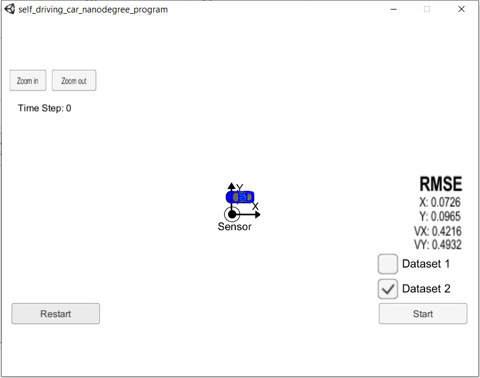

# Extended Kalman Filter 
Self-Driving Car Engineer Nanodegree Program

### Results
In this project, I utilized Kalman filter to estimate the state of a moving object of interest with noisy lidar and radar measurements. The RMSE of the test datasets are shown as following:

Dataset 1

| Item |   px  |   py  |   vx  |   vy  |
| ---- | ----- | ----- | ----- | ----- |
| RMSE | 0.097 | 0.085 | 0.451 | 0.440 |

Dataset 2

| Item |   px  |   py  |   vx  |   vy  |
| ---- | ----- | ----- | ----- | ----- |
| RMSE | 0.073 | 0.096 | 0.422 | 0.493 |

|       Dataset1        |       Dataset2        |
| :-------------------: | :-------------------: |
|  |  |

This project  Simulator which can be downloaded [here](https://github.com/udacity/self-driving-car-sim/releases)

### Build steps
This repository includes two files that can be used to set up and install [uWebSocketIO](https://github.com/uWebSockets/uWebSockets) for either Linux or Mac systems. 
For windows you can use either Docker, VMware, or even [Windows 10 Bash on Ubuntu](https://www.howtogeek.com/249966/how-to-install-and-use-the-linux-bash-shell-on-windows-10/) to install uWebSocketIO. 

1. mkdir build
2. cd build
3. cmake ..
4. make
5. ./ExtendedKF

### Instructions

Here is the main protcol that main.cpp uses for uWebSocketIO in communicating with the simulator.

INPUT: values provided by the simulator to the c++ program

["sensor_measurement"] => the measurement that the simulator observed (either lidar or radar)

OUTPUT: values provided by the c++ program to the simulator

["estimate_x"] <= kalman filter estimated position x

["estimate_y"] <= kalman filter estimated position y

["rmse_x"]

["rmse_y"]

["rmse_vx"]

["rmse_vy"]

---

### Dependencies

* cmake >= 3.5
  * All OSes: [click here for installation instructions](https://cmake.org/install/)
* make >= 4.1 (Linux, Mac), 3.81 (Windows)
  * Linux: make is installed by default on most Linux distros
  * Mac: [install Xcode command line tools to get make](https://developer.apple.com/xcode/features/)
  * Windows: [Click here for installation instructions](http://gnuwin32.sourceforge.net/packages/make.htm)
* gcc/g++ >= 5.4
  * Linux: gcc / g++ is installed by default on most Linux distros
  * Mac: same deal as make - [install Xcode command line tools](https://developer.apple.com/xcode/features/)
  * Windows: recommend using [MinGW](http://www.mingw.org/)

## Basic Build Instructions

1. Clone this repo.
2. Make a build directory: `mkdir build && cd build`
3. Compile: `cmake .. && make` 
   * On windows, you may need to run: `cmake .. -G "Unix Makefiles" && make`
4. Run it: `./ExtendedKF `

